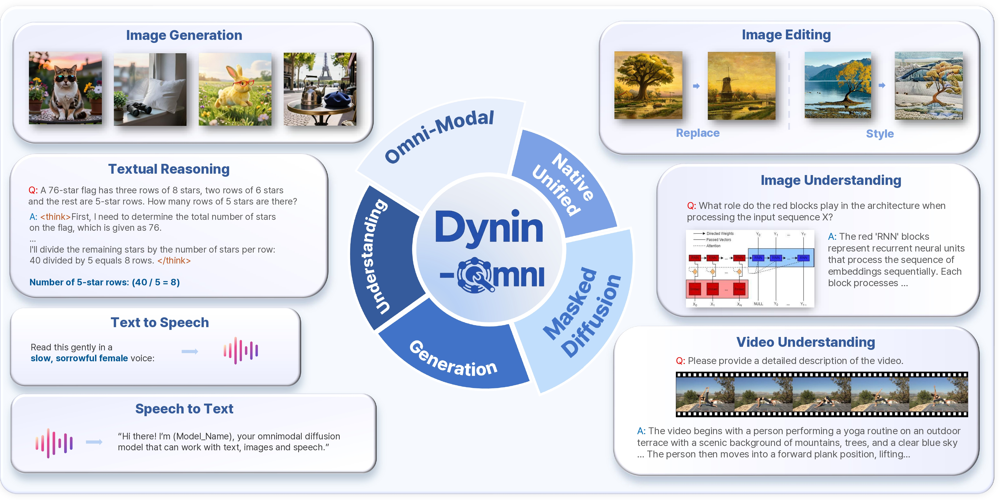

# Dynin-Omni: Omnimodal Unified Large Diffusion Language Model

<!-- markdownlint-disable MD033 -->

<html>
  <p align="center">
    <a href="https://github.com/AIDASLab/Dynin-Omni/blob/main/Dynin_Omni_paper.pdf">
      
    </a>
    <a href="https://dynin.ai/omni/">
      
    </a>
    <a href="https://huggingface.co/snu-aidas/Dynin-Omni">
      
    </a>
    <a href="https://huggingface.co/spaces/AIDAS-Lab/Dynin-Omni">
      
    </a>
  </p>
</html>

<br>

## Introduction

<html>
  <div style="margin: 0px">
    
    <p align="center">
    <em display="block"><span style="color: #808080; font-size: 10pt">Unified masked-diffusion modeling across textual reasoning, image generation, image editing, multi-modal understanding, text to speech, and speech to text.</span></em>
    </p>
  </div>
</html>

**Dynin-Omni: Omnimodal Unified Large Diffusion Language Model** is an 8B-scale masked-diffusion foundation model that unifies text, image, video, and speech understanding and generation within a single architecture.

Unlike autoregressive (AR) unified models that serialize heterogeneous modalities into a left-to-right sequence, Dynin-Omni models all modalities as discrete tokens in a shared vocabulary and performs generation via iterative masked denoising. This enables bidirectional context modeling, parallel multi-token prediction, and globally conditioned any-to-any inference without modality-specific expert decoders.

Training proceeds in three stages: (1) modality adaptation, (2) omni-modal supervised fine-tuning with model merging, and (3) continual capability scaling.

<br>

## vLLM-Omni

Dynin-Omni inference is supported via the [vLLM-Omni](https://github.com/vllm-project/vllm-omni) framework using the `dynin_omni` branch in the AIDASLab fork. Follow the instructions below. A Pull Request to the upstream [vLLM-Omni](https://github.com/vllm-project/vllm-omni) repository is in preparation. This section will be updated after the Pull Request is merged.

Clone the [AIDASLab/vllm-omni](https://github.com/AIDASLab/vllm-omni.git) repository (`dynin_omni` branch):

```bash
git clone https://github.com/AIDASLab/vllm-omni.git -b dynin_omni
cd vllm-omni
```

<br>

Create and activate a conda environment, then install dependencies:

```bash
conda create -n dynin_vllm python=3.12
conda activate dynin_vllm
pip install -e . # in vllm-omni directory
```

<br>

Set up the runtime environment:

```bash
REPO_ROOT=$(pwd)
PYTHON_BIN=$(which python) bash "$REPO_ROOT/vllm_omni/model_executor/models/dynin_omni/models/configs/speech/install_emova_deps.sh"
```

<br>

Run inference on vLLM-Omni using the entrypoint script:

```bash
bash examples/offline_inference/dynin_omni/run_single_prompt.sh [task] [options]
```

Available tasks:

- `t2t`: text → text
- `i2t`: image → text (Image Understanding)
- `s2t`: speech → text (ASR)
- `t2i`: text → image (Image Generation)
- `t2s`: text → speech (TTS)
- `i2i`: image → image (Image Editing)
- `v2t`: video → text (Video Understanding)

For detailed usage and task-specific arguments, use the `-h` option.

<br>

## Prerequisites

Direct local-machine inference and training with Dynin-Omni are supported. Follow the instructions below.

### Environment

Clone this repository:

```bash
git clone https://github.com/AIDASLab/Dynin-Omni.git
cd Dynin-Omni
```

<br>

Create and activate a conda environment:

```bash
conda create -n dynin_omni python=3.10
conda activate dynin_omni
```

<br>

Initialize the environment (installs and builds Python packages):

```bash
bash scripts/init_env.sh --overwrite
```

<br>

`--overwrite` forces the Hugging Face cache root to `datasets/huggingface` under the project root. Without `--overwrite`, the cache root is resolved as `HF_CACHE_DIR` > `HF_HOME` > project default.

<br>

## Inference

Dynin-Omni performs multimodal inference through iterative masked denoising. Target tokens are initialized as masks and refined over diffusion steps.

<br>

Entrypoint script:

```bash
bash scripts/inference.sh [--text|--i2i|--mmu|--speech|--t2i] [options]
```

The default configuration is `configs/dynin_omni_demo.yaml`.
`--result` defaults to `results/<mode>`.

<br>

### 1. Text Generation

Masked-diffusion text generation with block-wise decoding.

Validation script: `validation/generate.py`.

```bash
bash scripts/inference.sh --text
```

- Input questions (default): `validation/data/text/lm_questions.jsonl`.
- `jsonl` format: one sample per line (e.g., `{"question":"..."}`).
- Optional override: `--questions-file`.
- Fallback behavior: a built-in demo question is used when the file is missing or empty.

<br>

### 2. Multi-Modal Understanding (Image and Video)

Validation script: `validation/mmu_generate.py`.

```bash
bash scripts/inference.sh --mmu
```

- Image directory (`.jpg/.jpeg/.png/.webp`): default `validation/data/image` (override with `--mmu-image-root`).
- Video directory (`.mp4/.mov/.avi/.mkv/.webm`): default `validation/data/video` (create if absent, or override with `--video-image-root`).

<br>

### 3. Text-to-Image Generation

Discrete image tokens are generated via parallel masked refinement, followed by deterministic detokenization.

Validation script: `validation/t2i_generate.py`.

```bash
bash scripts/inference.sh --t2i
```

- Input data (default): `validation/data/text/t2i_metadata.jsonl`.
- `jsonl` format: one sample per line, e.g. `{"id":"t2i-00000","prompt":"..."}` (`prompt` is required).
- Optional alternative: `--validation-prompts-file` with a plain-text file (one prompt per line) instead of `jsonl`.

<br>

### 4. Image-to-Image Generation (Image Editing)

Validation script: `validation/i2i_generate.py`.

```bash
bash scripts/inference.sh --i2i
```

- Input `json` (default): `validation/data/text/i2i_edits.json`.
- `json` format: each item includes `id` (source image filename) and `prompt`.
- Source image directory (default): `validation/data/image` (override with `--origin-img-root`).

<br>

### 5. Speech (ASR and TTS)

Speech recognition and synthesis are performed within the same token-level diffusion backbone without a modality-specific decoder.

Validation script: `validation/speech.py`.

```bash
bash scripts/inference.sh --speech
```

- Default source: LibriSpeech ASR test split from Hugging Face (`openslr/librispeech_asr`).
- Optional local audio root: `--librispeech-root` (directory containing LibriSpeech `.flac` files).

<br>

## Training

Training configurations (datasets, hyperparameters, etc.) are defined in `configs/*.yaml`.

`scripts/train.sh` path variables (`CONFIG_FILE`, `TRAIN_SCRIPT`, `EXPERIMENT_CFG`, `LOG_DIR`) must be specified as project-root-relative paths.
The examples below assume a single-node setup; host/runtime variables should be adapted to the target environment.

Accelerate configuration can be prepared by running:

```bash
python -m accelerate config
```

Predefined configurations are also available in `accelerate_configs/`:

```bash
├── accelerate_configs/
│   ├── 1_gpu.yaml
│   ├── 1_node_8_gpus_deepspeed_zero2.yaml
│   ├── 1_node_8_gpus_deepspeed_zero3.yaml
│   └── 8_node_8_gpus_deepspeed_zero2.yaml
```

<br>

### Stage 1 Omni-Modal Pretraining

Stage 1 adapts newly introduced modalities (video and speech) to the masked-diffusion backbone. The following modality directions are activated:

- Video → Text (Video Captioning)
- Speech → Text (ASR)
- Text → Speech (TTS)

This stage anchors video and speech tokens into the shared semantic token space under text supervision.

```bash
CONFIG_FILE=accelerate_configs/1_node_8_gpus_deepspeed_zero2.yaml \
EXPERIMENT_CFG=configs/dynin_omni_stage1_llada_instruct.yaml \
TRAIN_SCRIPT=training/train_dynin_omni_stage1.py \
./scripts/train.sh
```

Stage 1 starts from the [`MMaDA-8B-MixCoT`](https://huggingface.co/Gen-Verse/MMaDA-8B-MixCoT) backbone checkpoint and extends it to support video and speech modalities through vocabulary expansion and text-centric alignment.

<br>

### Stage 2 Omni-Modal Supervised Fine-Tuning

Stage 2 continues from the Stage 1 checkpoint and performs full omni-modal supervised fine-tuning.

Activated modality directions:

- Text → Text (Chat & Reasoning)
- Image → Text, Video → Text (Multi-Modal Understanding)
- Text → Image (Image Generation)
- Image → Image (Image Editing)
- Speech → Text (ASR)
- Text → Speech (TTS)

Before training, model merging is applied between the original backbone and the Stage 1 checkpoint to mitigate catastrophic forgetting. Explicit `<EOS>` supervision enables stable variable-length generation across modalities.

```bash
CONFIG_FILE=accelerate_configs/1_node_8_gpus_deepspeed_zero2.yaml \
EXPERIMENT_CFG=configs/dynin_omni_stage2_llada_instruct.yaml \
TRAIN_SCRIPT=training/train_dynin_omni_stage2.py \
./scripts/train.sh
```

<br>

### Stage 3 Continual Omni-Modal Supervised Fine-Tuning

Stage 3 continues from the Stage 2 checkpoint, retaining all modality directions while further scaling model capabilities.

Key enhancements include:

- Extended context length
- Higher-resolution image modeling
- Long-form speech generation (up to 21 seconds)
- Thinking-mode control (`\think` / `\no_think`)
- Chain-of-thought supervision
- Increased synthetic data for reasoning and generation

This stage improves reasoning depth, perception granularity, and long-form generation while preserving the unified masked-diffusion objective.

```bash
CONFIG_FILE=accelerate_configs/1_node_8_gpus_deepspeed_zero2.yaml \
EXPERIMENT_CFG=configs/dynin_omni_stage3_llada_instruct.yaml \
TRAIN_SCRIPT=training/train_dynin_omni_stage3.py \
./scripts/train.sh
```

Stage 3 starts from the Stage 2 checkpoint specified in `configs/dynin_omni_stage3_llada_instruct.yaml` and performs continual capability scaling under the same unified diffusion objective.

<br>

## Evaluation

Evaluation details are provided in [evaluation/README.md](evaluation/README.md).

<br>

<html>
  <p align="center">
    
  </p>
</html>
